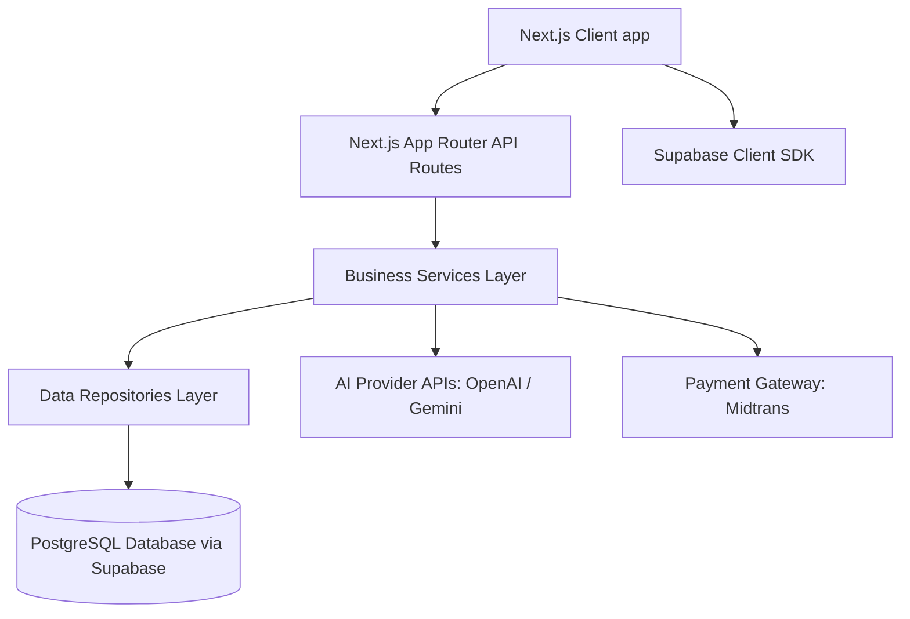

# Nyiur Nanggroe — System Architecture

This document describes the high-level architecture and file organization of the Nyiur Nanggroe platform.

## Architecture Diagram



## Folder Structure

```
d:\lama\NYIURNANGGROE\
├── docs/                      # Architectural and Deployment Docs
├── public/                    # Static Assets (Images, Icons)
├── src/
│   ├── app/                   # Next.js App Router (Pages & API Routes)
│   │   ├── (auth)/            # Auth Page Router
│   │   ├── (public)/          # Landing Page and Public Routes
│   │   ├── api/               # API Route Handlers
│   ├── components/            # Reusable UI & Layout Components
│   │   ├── ai/                # AI Chat & Visual Search UI
│   │   ├── home/              # Homepage Sections
│   │   ├── ui/                # Base Design System Elements
│   ├── lib/                   # Libraries, Utilities, and State
│   │   ├── services/          # Core Business Logic Layer
│   │   ├── repositories/      # Database Interaction Layer
│   │   ├── stores/            # Zustand Client-side State Stores
│   │   ├── supabase/          # Supabase Clients (Server/Client)
│   │   ├── utils/             # Helper Functions
│   │   └── validators/        # Zod Validation Schemas
```

## Architecture Design Decisions

1. **Separation of Concerns**: UI components are separate from services (business logic) and repositories (database queries). This makes the app highly maintainable and clean.
2. **State Management**: Client state is decoupled using Zustand, while Supabase provides real-time backend synchronization.
3. **API & Database Security**: Row Level Security (RLS) is configured in PostgreSQL via Supabase, with middleware providing server-side guard rails.
